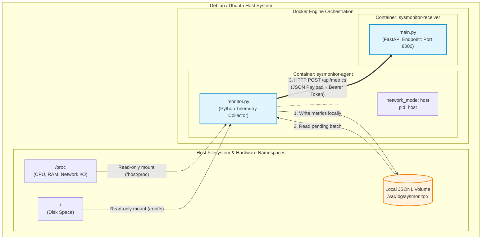

# Lightweight Containerised Linux Monitoring System

A zero-dependency, containerised system telemetry monitoring solution designed for Debian and Ubuntu hosts. This project features a lightweight Python 3 monitoring agent that securely reads host hardware metrics directly from system namespaces and streams them to a containerised FastAPI receiving backend using token-based authentication.

## Architecture Overview



The system consists of two primary microservices orchestrated via Docker Compose:

### SysMonitor Agent (sysmonitor-agent)

Runs as a container on the target host. By utilising host network/PID namespaces and read-only volume mounts (`/proc` and `/`), it bypasses container isolation to collect true host telemetry (CPU, RAM, Storage, Network I/O) without requiring any third-party Python packages.

### SysMonitor Receiver (sysmonitor-receiver)

A high-performance FastAPI API endpoint that validates incoming telemetry payloads against a pre-shared bearer token and processes the metrics.

## Repository Structure

```
.
├── agent/
│   ├── conf/
│   │   └── config.json       # Agent configuration (endpoint, token, intervals)
│   ├── src/
│   │   └── monitor.py        # Zero-dependency hardware metric collector
│   └── Dockerfile            # Agent container specification
├── server/
│   ├── app/
│   │   └── main.py           # FastAPI ingestion receiver engine
│   ├── Dockerfile            # Receiver container specification
│   └── requirements.txt      # API framework dependencies
├── docker-compose.yml        # Root orchestration file
└── README.md                 # Project documentation
```

## Prerequisites

Linux host running Debian or Ubuntu.

Docker and Docker Compose installed on the host machine.

User account added to the docker group (optional, to run commands without sudo).

## Configuration

Before deploying the containers, align the shared authentication tokens and endpoint configurations across both components.

1. Compose File and Server Authentication

The repository ships a `docker-compose.yml` at the root. A complete, copy-paste-ready example is shown below. Define your secure pre-shared key once via the `AGENT_TOKEN` environment variable on the receiver:

```yaml
services:
  sysmonitor-receiver:
    build: ./server
    container_name: sysmonitor-receiver
    environment:
      - AGENT_TOKEN=your_secure_pre_shared_key
    ports:
      - "8000:8000"
    restart: unless-stopped

  sysmonitor-agent:
    build: ./agent
    container_name: sysmonitor-agent
    network_mode: host
    pid: host
    depends_on:
      - sysmonitor-receiver
    volumes:
      - /proc:/host/proc:ro
      - /:/rootfs:ro
      - ./agent/conf/config.json:/app/conf/config.json:ro
      - agent_data:/var/log/sysmonitor
    restart: unless-stopped

volumes:
  agent_data:
```

The receiver listens on port 8000 (the uvicorn/FastAPI default). If you prefer to expose it on 5000 externally, change the published mapping to `"5000:8000"` and update `server_url` in `config.json` to match.

2. Agent Configuration

Open `agent/conf/config.json` and ensure the `api_token` matches the server token exactly. Set your desired collection interval (in seconds):

```json
{
  "server_url": "http://127.0.0.1:8000/api/metrics",
  "api_token": "your_secure_pre_shared_key",
  "collection_interval_seconds": 10,
  "local_buffer_path": "/var/log/sysmonitor/buffer.jsonl"
}
```

## Deployment & Usage

1. Start the System

Navigate to the repository root directory and build/launch both services in the background:

```bash
docker-compose up --build -d
```

2. Verify Logging Output

To monitor incoming telemetry data and confirm successful ingestion on the server receiver, view the real-time container logs:

```bash
docker logs -f sysmonitor-receiver
```

Expected log output format:

```
[*] Batch received: 1 events.
    -> Host: vm-image | Time: 2026-06-20T19:45:00+00:00 | CPU Load (1m): 0.12
```

3. Local Buffer Fallback

If the server backend experiences downtime or becomes network-unreachable, the agent automatically maintains data persistence. It buffers telemetry locally into a line-delimited JSON (.jsonl) format file on the host at:

```
/var/lib/docker/volumes/monitoring-agent_agent_data/_data/buffer.jsonl
```

Once network connectivity to the receiver is restored, the agent automatically flushes the backlog to the server in chronological batches and clears the local cache file to conserve disk space.

4. Stop the Services

To safely bring down the tracking agent and receiver containers:

```bash
docker-compose down
```

## Telemetry Schema Detail

The agent collects and emits structured time-series payloads matching the following format:

```json
{
  "timestamp": "2026-06-20T19:45:00.123456+00:00",
  "host": {
    "hostname": "ubuntu-server-node"
  },
  "cpu": {
    "load_average_1m": 0.15,
    "load_average_5m": 0.08,
    "load_average_15m": 0.02
  },
  "memory": {
    "total_bytes": 16712345600,
    "used_bytes": 4212345600,
    "free_bytes": 12500000000,
    "usage_percent": 25.2
  },
  "storage": {
    "mount_point": "/",
    "total_bytes": 105412345600,
    "used_bytes": 22123456000,
    "free_bytes": 83288889600,
    "usage_percent": 20.98
  },
  "network": {
    "bytes_sent_per_sec": 1420,
    "bytes_recv_per_sec": 8940
  }
}
```